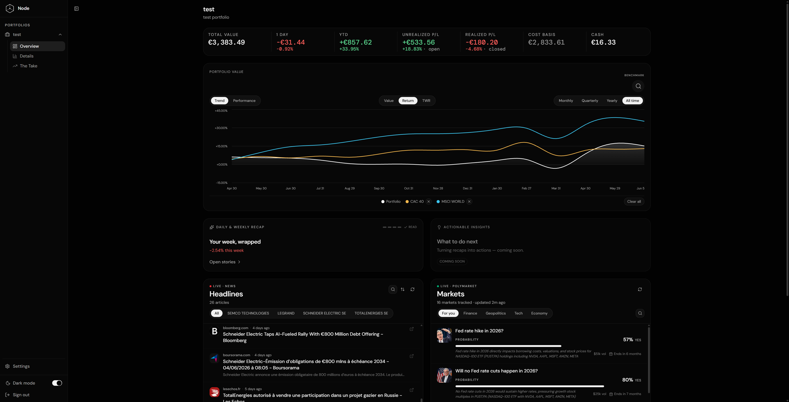
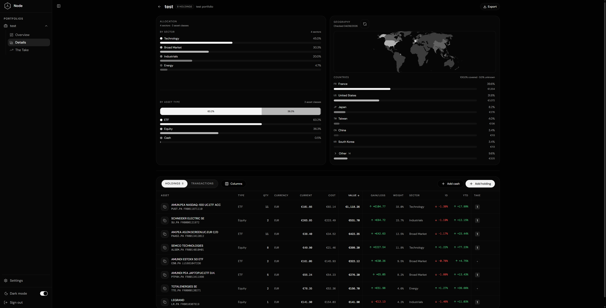
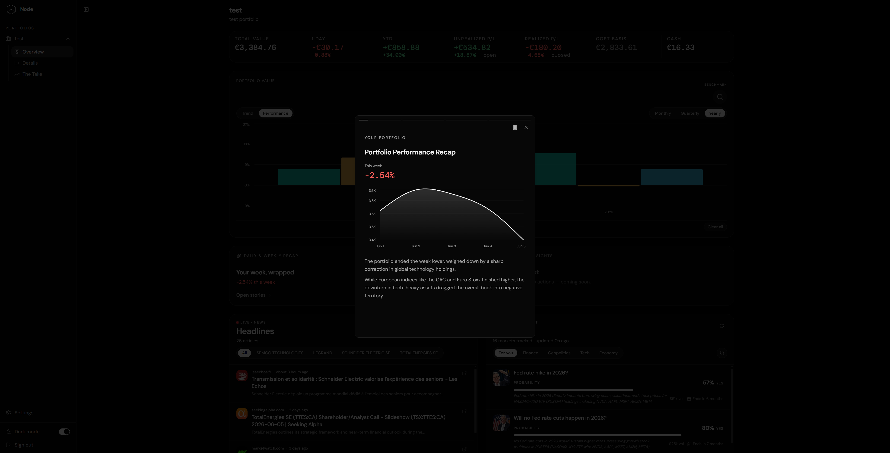
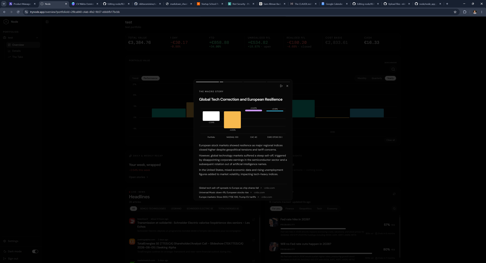
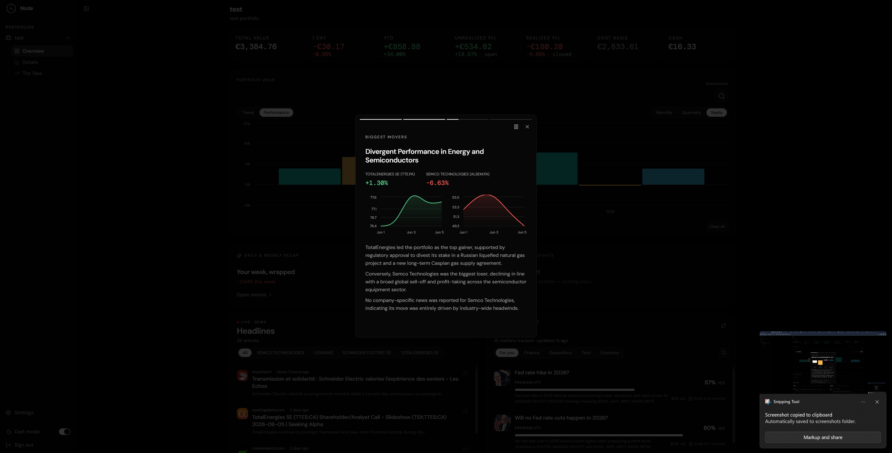
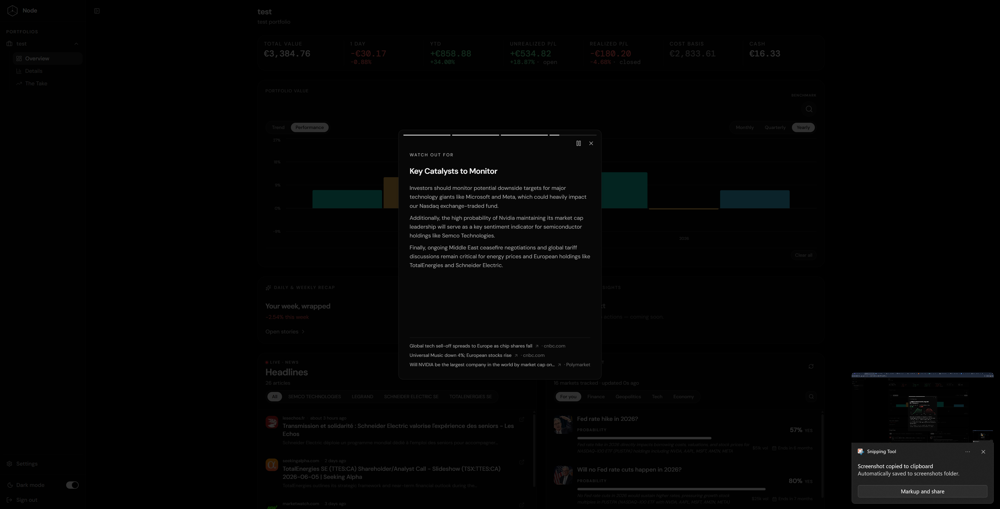

  

<b>An AI-native personal finance app that I'm building solo for now.</b>

Node starts as a portfolio tracker that explains what's moving your money — and is being built toward a personal finance hub that remembers you. The bet: future users of personal finance tools would expect personalization in form of persistent memory and voice interactions.

---

## The problem

Two things are broken about how retail investors manage money today.

- **Incumbents have poor UX.** Bank apps don't treat their interfaces as products. The richer alternatives swing the other way — bloated, doing everything, still missing the simple things an individual investor actually wants. In France especially, there's a gap between a clean experience and genuine utility.
- **Every tool is fragmented and stateless.** Your portfolio is in one app, your thesis in your head, your goals nowhere. Nothing connects them, and nothing *remembers* you.

Node closes both gaps: bridge great UX with AI-driven utility, and build a system that gets smarter the longer you use it.

## What makes Node different

- **UX and AI utility, together** — neither traded off for the other. That trade-off is the whole reason incumbents fall short.
- **Personal context, real world intelligence** — the AI is grounded in users' data and enhanced with real world events to provide the most accurate and freshest context.
- **Persistent memory, the app evolves with you** — Node is being built with ambition to become another room in your home, the more you use it the more you'd want to come back to it.

## Current features (live)

- **Daily / weekly recaps** — plain-language explanations of what moved your portfolio and *why*, mapped to the exact holdings you own (agentic loop + deterministic data merge)
- **Holdings-tailored news feed**
- **Prediction-market feed** (Polymarket) for live macro contex
- **Benchmark overlay** with AI-suggested comparisons
- **Allocation breakdown** — sector, asset type, geography
- **Live prices**
- **Notes** attached to individual holdings
- *The Take* — a thesis-tracking agent (first draft/experiment)

## Roadmap

**Next**
- Expense management, budgets, and goals
- Insights (actionable steps)
- Rules & strategies for then investment portfolio (weight targets, rebalancing)
- Inverted gamification — rewarding discipline, not engagement

**The bigger vision**
- Personalization layer and persistent memory across the app
- A voice agent - Natural-language / voice queries

## Why now

In France, the average ETF investor has gone from roughly 60 years old in 2018 to about 38 by the end of 2025 (AMF). A generation is starting to invest — and European households still hold far less in equities than they could, with a large share of wealth sitting idle in low-return deposits. The demand is also shifting from tools that *display* data to tools that *interpret* it. Node is positioned as the understanding-and-memory layer for that arriving cohort — a patient bet placed slightly ahead of the wave.

## Tech stack

**Frontend** — Next.js 16, React 19, Tailwind CSS 4, Radix UI, Recharts, Framer Motion

**Backend & infrastructure** — Node.js, Cloudflare Workers, Supabase (Postgres + pgvector)

**AI models** *(optimising for cost / performance — xAI offers competitive models at a fraction of frontier pricing)*

| Use case | Model |
|---|---|
| Daily / weekly recaps | `gemini-3.5-flash` |
| The Take — main agent | `grok-4.20-0309-reasoning` |
| The Take — sub-agent | `grok-4-1-fast-non-reasoning` |
| CSV import normalization | `grok-4-1-fast-non-reasoning` |
| Benchmark suggestions | `grok-4.20-0309-reasoning` |

Other providers under evaluation: DeepSeek (v4 flash/pro), additional Gemini tiers.

## Why I'm building this

Node is a personal product initiative combining product management, AI experimentation, personal finance, and UX thinking. It started from a simple observation: French incumbents offer subpar UX and lack features I actually wanted, while the alternatives were either too thin or too bloated. The market could use a better tool.

It's also how I'm learning the modern AI stack hands-on — agents, memory, RAG, orchestration, evals — by making real architectural decisions on a real product, end to end, rather than following tutorials.

## Status

Active work in progress. The repository is public for portfolio and demonstration purposes and may evolve significantly as the product matures; parts of the implementation may later become private or be restructured.

## Screenshots *(work in progress)*

**Overview page**

**Detail page - Sector & Asset-type allocations with holdings table**

**AI-driven recaps**
<table>
  <tr>
    <td></td>
    <td></td>
  </tr>
  <tr>
    <td></td>
    <td></td>
  </tr>
</table>